# Hansel And Gretel

---

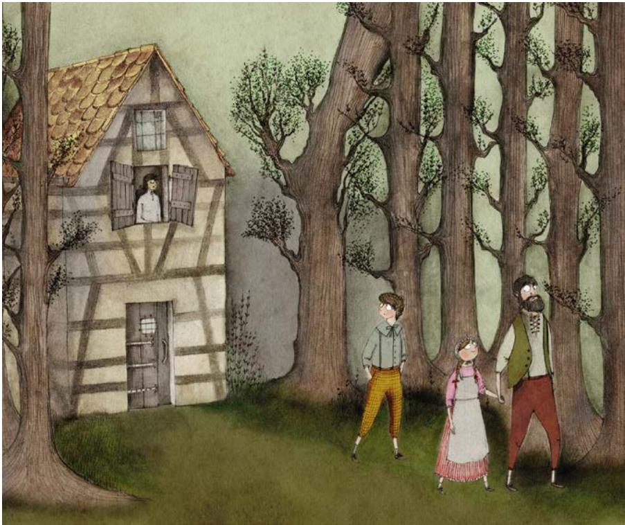

Hansel and Gretel's family had almost no food left. Their father grew weak. Their stepmother grew thin. Young Gretel could not even remember the good times.

One morning, Father called them. "Come for a walk in the woods," he said.

Hansel saw his stepmother's sharp face watching from the window, and he got a bad feeling.

They followed Father deep into the forest. "Where are we going?" Hansel asked.

"Shush," said Father. "Take our last bread." He gave Hansel a dry crust.

Hansel was very hungry, but something was wrong. He decided not to eat the bread. He tore it into small pieces. He dropped the crumbs as he walked to make a path home.

---

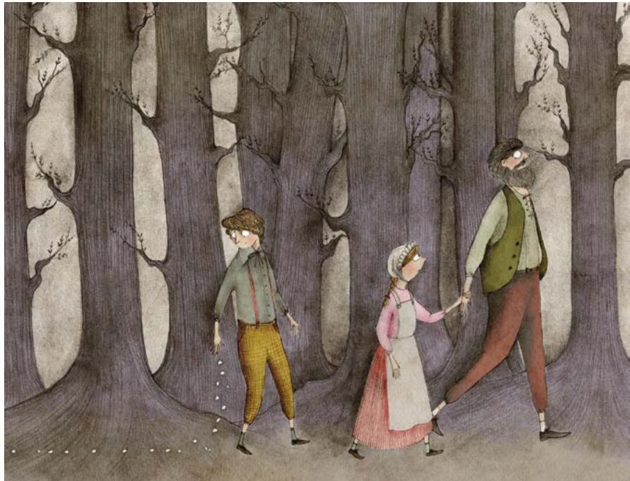

Father suddenly stopped. "We can't feed you anymore," he said. His voice shook. "You must find a new home in the nearby village." With that, he disappeared between the trees.

---

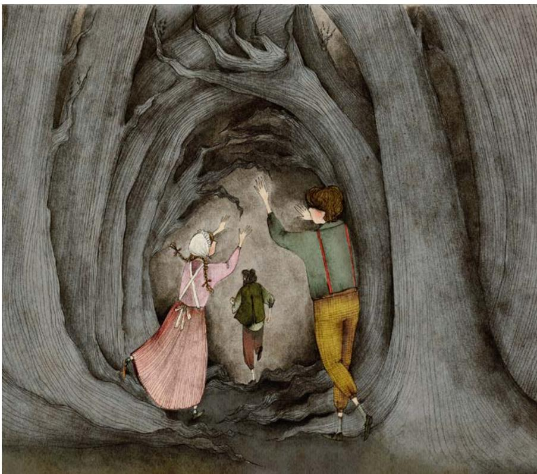

Gretel tried to chase him, but she fell behind. Hansel showed her his path of bread crumbs, and they began to follow it home.

---

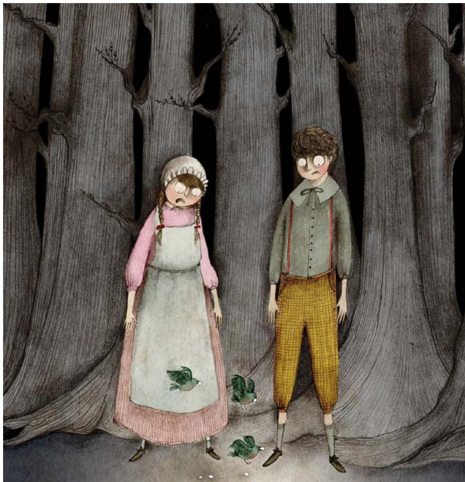

Hansel kept losing the path. Then they saw a bird fly down and steal a crumb.

"Birds ate your path," Gretel cried. "We're lost!" The woods were growing dark.

Hansel tried to be brave. They walked for a long time. Finally, they saw light through the trees.

In a clearing was a little house made entirely of candy! They ran toward it, mouths watering. They were so busy eating, they did not hear the door open.

---

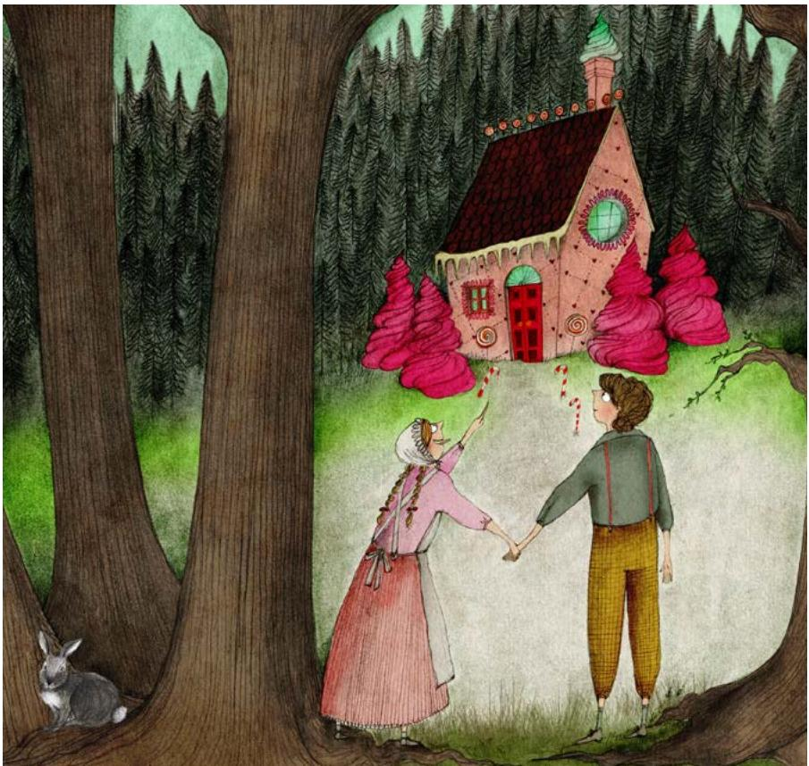

"Do I hear someone eating my house?" a voice said cheerfully. It was a little old woman with cloudy eyes. "Please come in!" she offered.

---

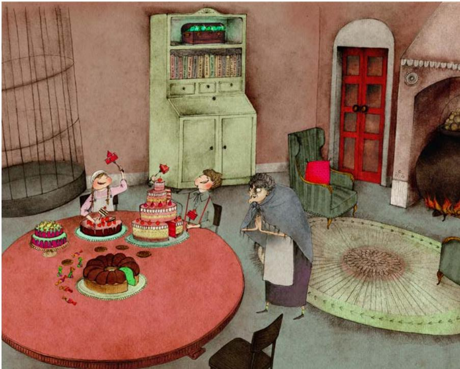

Inside, the woman blindly felt her way around the house as she brought them gingerbread, cake, and pie. Hansel and Gretel ate until they were full. Then the old woman opened a small treasure chest.

"You can play with these," she said. She tossed Hansel a jewel as big as his fist! The children played until they got sleepy. The woman tucked them into a warm feather bed.

In the morning, the children had waffles and cream for breakfast. When they were full, the woman said, "Could you help me with some chores? My eyesight isn't very good."

The woman gave Gretel a broom. Then she pointed to a high window that was broken. A big empty birdcage hung next to it. "Can you reach it, Hansel?" she asked.

Hansel climbed way up into the birdcage. Just as he got inside, he heard a click! The door shut behind him.

---

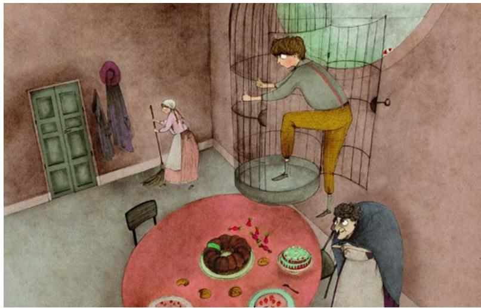

---

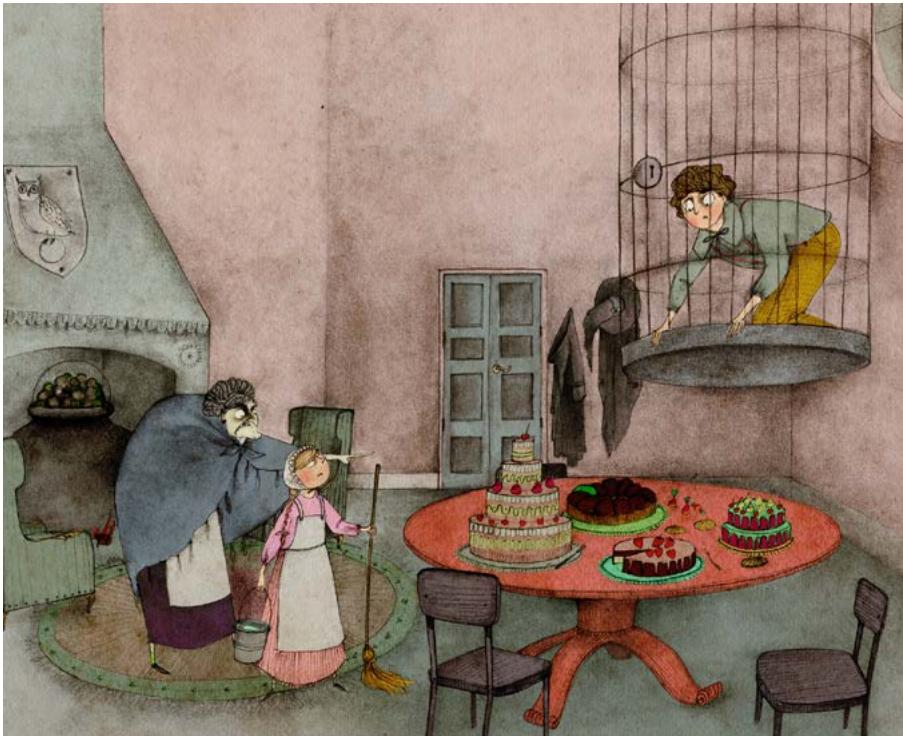

Gretel heard the click and turned to see a wicked smile on the old woman's face. "What did you do?" she asked.

"Get back to work!" she snapped.

"Have some more cake," she said to Hansel. "Soon you'll be nice and fat."

Gretel shuddered. She did not like the sound of that. She was too scared to say anything, so she kept cleaning.

Every day, the woman gave Hansel more treats. Every day, she pinched his arm.

When the woman felt Hansel's arm getting fat, an evil smile spread across her face. Gretel shuddered again.

While Gretel was sweeping, she had an idea. She tossed a chicken bone into Hansel's cage. "Make her grab this instead of your arm," she whispered.

The next day, the woman pinched the bone. She frowned. "Why aren't you getting fat?" she said.

---

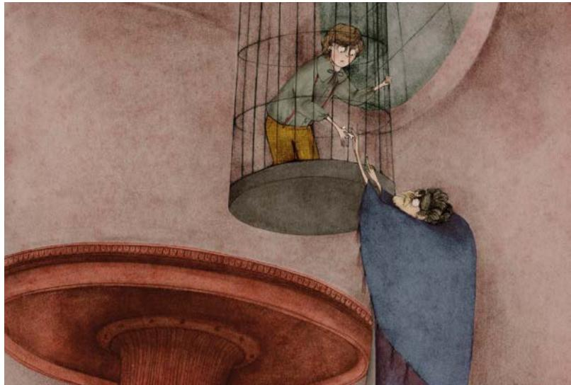

A few days later, the woman grew angry. "I'm not waiting any longer," she growled. "Girl, fill that big pot with water and build a fire!"

Gretel did as she was told. The woman went to Hansel's cage. She stretched high to reach the door.

This was Gretel's chance!

---

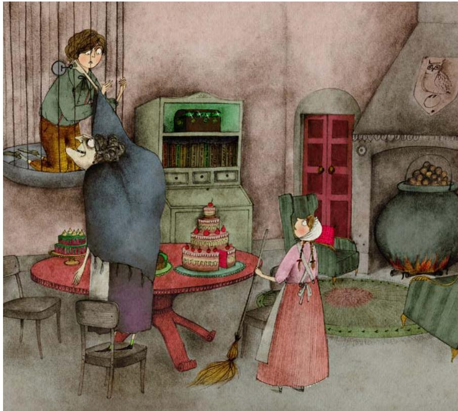

Gretel swung her broom at the cage, knocking it from its hook. As the cage and Hansel came crashing down, the woman stumbled backward and fell.

Hansel wiggled free. Together, Hansel and Gretel pushed the woman into the cage and slammed the door.

---

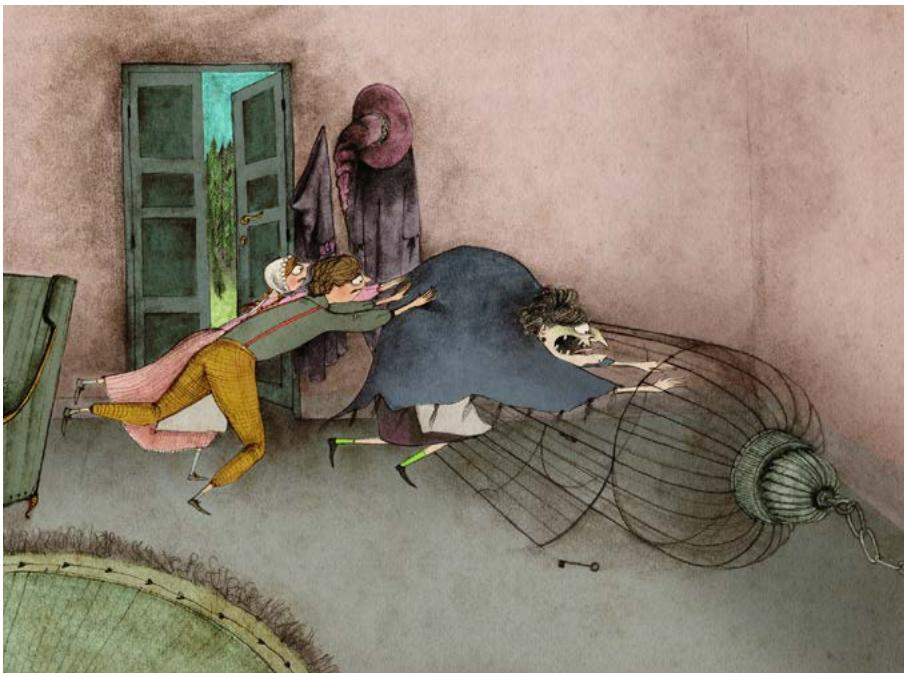

"Let me out!" she screamed.

Hansel grabbed the treasure chest, and the children fled into the forest.

They were back where they'd started, lost in the woods. Still, Hansel and Gretel felt less afraid than before.

They kept walking. Soon they heard a voice calling their names from far away. Afraid, they hid in the bushes and waited.

Then they realized who it was.

---

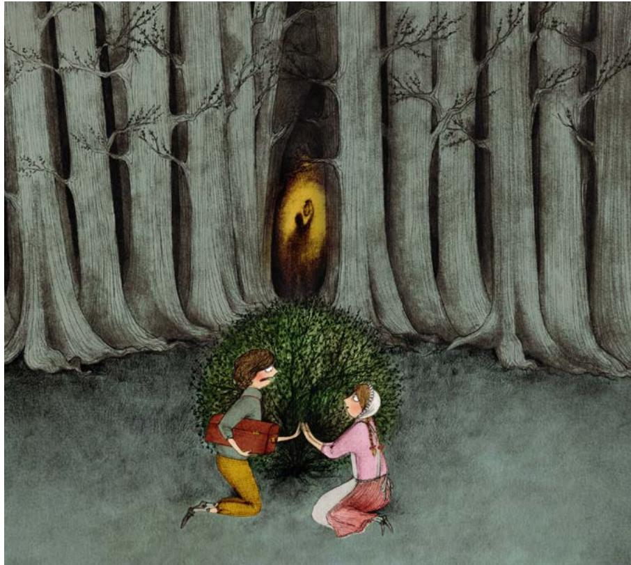

"Father!" Gretel cried. The children ran to him. Father's eyes were red from crying.

"I'm so sorry," he wept. "I sent your stepmother away. I've been searching for you for days!" Then his smile faded. "We still have no food," he sighed.

---

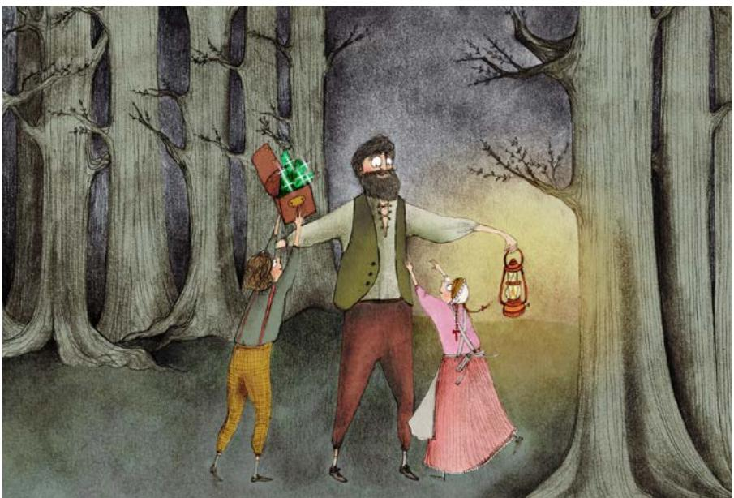

Hansel showed him the treasure chest. "We can buy all the food we want!" he said.

Their laughter echoed through the forest. Together, they headed home.